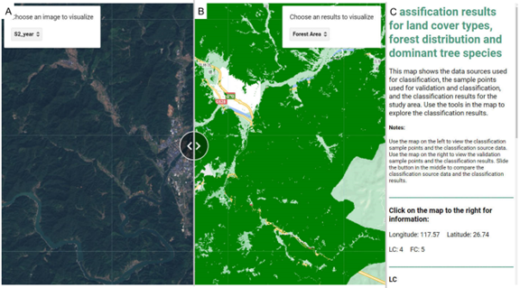
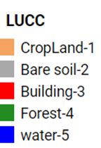
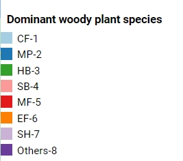
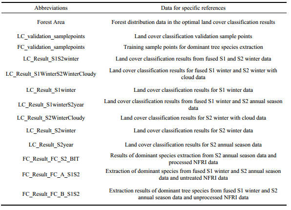

# APP for the presentation of classification results for land cover types, forest distribution, and dominant tree species

## Introduction

Publishing an APP on GEE that displays classification results helps to visualize classification results and allows forest managers to develop forest management plans better.

With the APP published by GEE, as shown in the figure below, the page is divided into three main parts: (A), (B), and (C).The (A) section contains the study area boundary, original data, and classified sample points, which can be viewed by clicking the selection button in the top left corner of the APP. The (B) section contains the validation sample points, land covers, and tree species classification results. Similarly, these can be viewed by clicking the selection button in the top right corner of the APP. In part (B), the mouse clicks anywhere in (B) to view the coordinates of this point and the best results of land cover classification and dominant tree species classification in (C). A sliding button between (A) and (B) can be dragged using the mouse to compare the accuracy of the classification results. Part (C) briefly introduces the APP and a legend of the classification results. The best results of the land cover classification and the dominant tree species classification can be downloaded by clicking the Download button.

## Data preparation

This app uses the method of uploading the data to be visualized into Cloud Assets before displaying it to keep it running fast. The data to be prepared is as follows:

1. Study area boundaries: Upload according to the purpose of the study.
2. Classification data sources: the type and timing of the data source are determined by the remote sensing imagery and the purpose of the classification.Sentinel-1 and -2 imagery data from 2018 and topographic data were selected for this study.
3. Training and validation sample points include manually interpreted land cover sample points and dominant tree species sample points generated by National Forest Resources Inventory data.
4. Land cover classification results: 10 m land cover classification results from different data sources (see manuscript for classification methods).
5. Dominant tree species classification results: 10 m dominant tree species classification results from different data sources (see manuscript for classification methods).

## Legend and classification codes

The land cover  classification result codes: 1, 2, 3, 4, and 5 correspond to Cropland, Bare soil, Building, Forest, and Water, respectively.

The dominant forest species codes are as follows: 1, 2, 3, 4, 5, 6, 7, and 8 correspond to CULA, PM, HB,
SB, BB, EF, SH, and Others, respectively. CULA is the abbreviation for Chinese fir (Cunninghamia lanceolata). PM is the abbreviation for Pinus Masson. HB is the abbreviation for hard-leaved mixed forest (with hard-leaved tree species accounting for 65% or more of the total stocking). SB is the abbreviation for soft-leaved mixed forest (with soft-leaved tree species accounting for 65% or more of the total stocking). BB is the abbreviation for Bamboo. EF is the abbreviation for Economic forest. SH is the abbreviation for Shrubs. Others represent other tree species in mixed or pure forests.

## Introduction to abbreviations in APP

The following two tables include all the abbreviated descriptions in the APP, where all remote sensing data are from 2018. S2: Sentinel-2; S1: Sentinel-1; LC: land cover types; FC: forest dominant tree species.

Table 1 Abbreviations on the left of the map

Table 2 Abbreviations on the right of the map

## Links

The app can be viewed via the link below:

[https://chenwugui7170.users.earthengine.app/view/resultdisplay](https://chenwugui7170.users.earthengine.app/view/resultdisplay)

## Acknowledgments

This work was supported by GEE: [https://developers.google.com/earth-engine](https://developers.google.com/earth-engine)

The main methods used are found here：[https://developers.google.com/earth-engine/guides/apps](https://developers.google.com/earth-engine/guides/apps)

## Citation

Chen X, Sun Y. Using the Google Earth Engine cloud platform to fuse multiple sources of data for dominant tree species identification and visualization of results.

---
